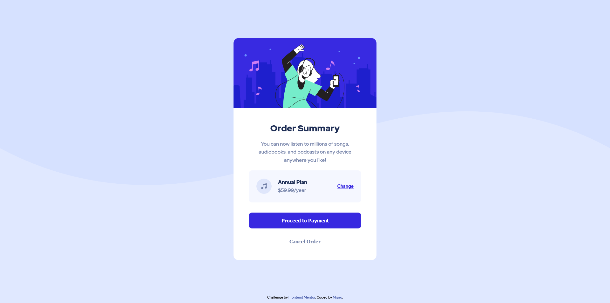

# Frontend Mentor - Order summary card solution

This is a solution to the [Order summary card challenge on Frontend Mentor](https://www.frontendmentor.io/challenges/order-summary-component-QlPmajDUj). Frontend Mentor challenges help you improve your coding skills by building realistic projects. 

## Table of contents

- [Overview](#overview)
  - [The challenge](#the-challenge)
  - [Screenshot](#screenshot)
  - [Links](#links)
- [My process](#my-process)
  - [Built with](#built-with)
  - [What I learned](#what-i-learned)
  - [Continued development](#continued-development)
  - [Useful resources](#useful-resources)
- [Author](#author)
- [Acknowledgments](#acknowledgments)

**Note: Delete this note and update the table of contents based on what sections you keep.**

## Overview

### The challenge

Users should be able to:

- See hover states for interactive elements

### Screenshot

### Links

- Solution URL: [Add solution URL here](https://github.com/MisaoDev/fm-order-summary-component)
- Live Site URL: [Add live site URL here](https://misaodev.github.io/fm-order-summary-component/)

## My process

### Built with

- Semantic HTML5 markup
- CSS custom properties
- Flexbox

### What I learned

#### CSS

- Gained some experience using custom properties / CSS variables.
- Learned about [fallback colors](https://github.com/CSSLint/csslint/wiki/Require-fallback-colors), and started adding them!
- Tinkered with flex (just started learning).
- Learned the horrible truth that is CSSLint bugs.

#### Misc

- I'm starting to remember git commands by heart.

### Continued development

I want to start using CSS variables a lot more. And become more used to the git initialization process.

### Useful resources

- [Require fallback colors](https://github.com/CSSLint/csslint/wiki/Require-fallback-colors) - CSSLint wiki article on fallback colors.
- [MDN Box Shadow Generator](https://developer.mozilla.org/en-US/docs/Web/CSS/CSS_Background_and_Borders/Box-shadow_generator)

## Author

- Website - [-soon-](#)
- GitHub - [MisaoDev](https://github.com/MisaoDev)
- Frontend Mentor - [@yourusername](https://www.frontendmentor.io/profile/yourusername)

## Acknowledgments

Thanks to Laura who's always providing some input on my projects.
